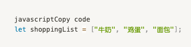
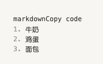
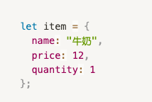

# Assignment 03

## 作业目标:

通过这次的作业，你将会练习JavaScript中的基本数据类型、数组、对象、条件语句、循环语句和函数的应用。

## 作业要求:

> **一、数据与变量：**

1. 创建一个购物清单数组，例如:
  

> **二、数组应用：**

1. 向购物清单中添加两样物品，并输出更新后的清单。

2. 从购物清单中删除最后一项物品，并输出结果。

> **三、条件与循环：**

1. 创建一个函数，当购物清单中的物品超过5项时，在控制台输出"你的购物车满了"。

2. 使用循环语句遍历购物清单，将每一项物品在控制台上以编号的形式输出。例如：
  

> **四、函数与对象：**

1. 创建一个函数，该函数接受物品名称作为参数，并返回该物品是否在购物清单中。

2. 创建一个购物物品对象，其中包括物品名称、价格和数量。例如:
  

